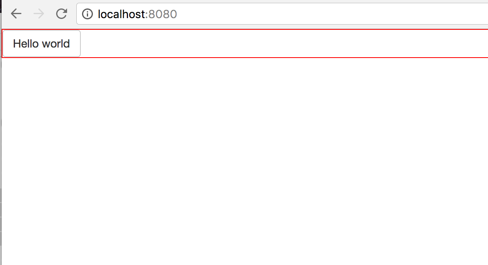

# Blockai Coding Challenge

## Challenge Goal

The goal of this challenge is to use React to build a simple paginated
UI (list or grid) of public Blockai copyright claims, using the Blockai
API.

Each list or grid item should probably contain the name and avatar of
the user who made the claim, the name and description of the claim, a
link to the Blockai claim URL, etc.

Ultimately those are just suggestions and you are free to chose how you
want to build the UI. If you need any clarification, feel free to ask.

## Boilerplate

This repository contains boilerplate code which is representative of our
current front end stack (webpack, babel, react, redux, eslint, sass,
etc.).

You do not have to use any of the boilerplate code in this repository
but it might help you get started more quickly. If you do use it, feel
free to change anything, as long as you use React.

The following will be counted as bonus but is not strictly required:
writing a few tests, making eslint tests pass (`npm run lint`), using
redux, using bootstrap, using react-router, commenting the code, etc.

## Install

```
git clone git@github.com:blockai/code-challenge.git
cd code-challenge && npm install
```

## Usage

```
npm run hot
open http://localhost:8080
```

You should see:



The main entry point for the UI is in [src/index.jsx](./src/index.jsx).

## API documentation

In order to retrieve copyright claims, you will need to use our API. As
part of this challenge, you will need to figure out how to interpret the
response and query parameters on your own.

[https://api.blockai.com/v1/registrations/challenge?include=user&page=1&limit=10](
https://api.blockai.com/v1/registrations/challenge?include=user&page=1&limit=10)

[https://api.blockai.com/v1/registrations/challenge?include=user&page=1&limit=10&search=flower](https://api.blockai.com/v1/registrations/challenge?include=user&page=1&limit=10&search=flower)

Hints:

- you will need to use `page` for pagination.
- `include=user` includes user objects to each copyright claim
- `search` searches for names of copyright claims

PS: I wrote the backend for this API quickly and there might be bugs,
feel free to let me know if that's the case!
